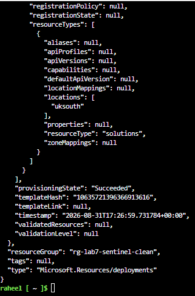
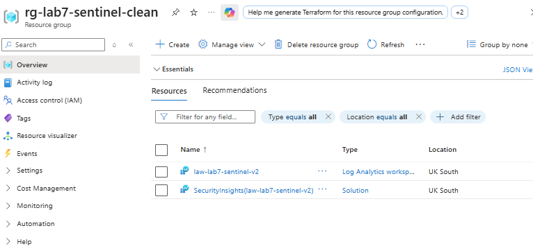
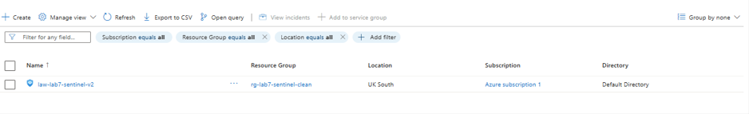
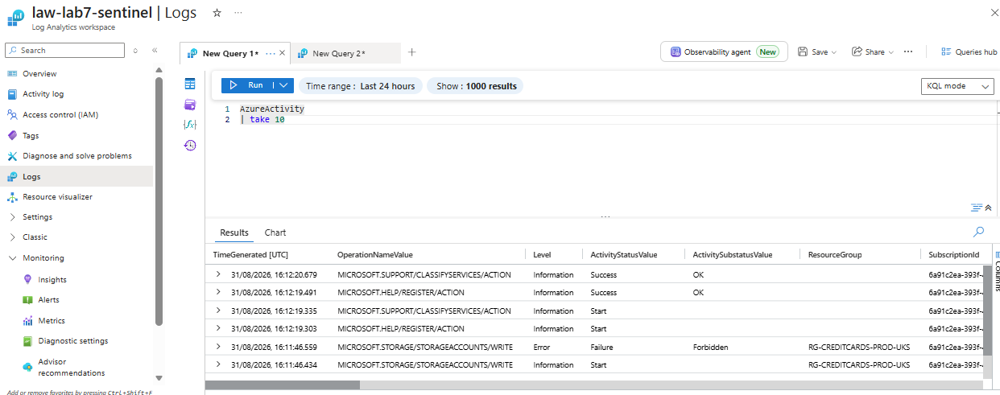
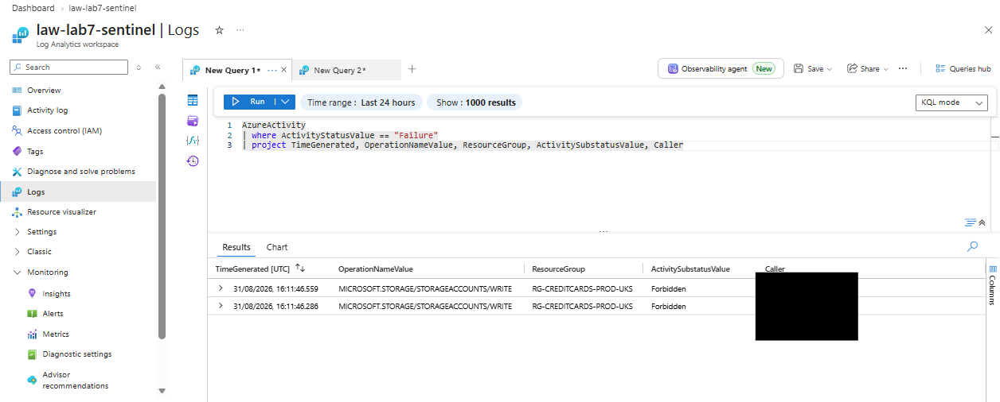
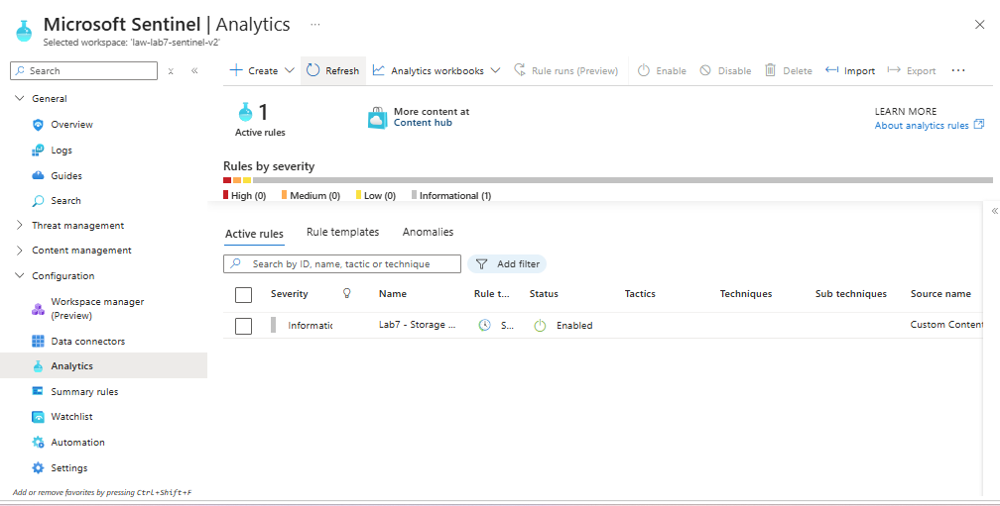
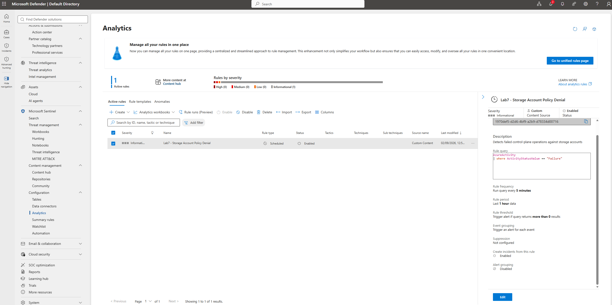

# Detection & Posture Monitoring: Building a Working Sentinel Pipeline

## Scenario

Governance work regularly surfaces control gaps after the fact — a repository missing scanning, a resource missing a tag, a supplier SLA breach nobody was watching for. In every case, the same underlying question sits behind the investigation: was there ever a way to have been *told* automatically, rather than finding out by chance or by someone else's report?

This lab set out to build that capability end to end, in a sanitised personal environment: generate real activity on an Azure resource, route it into a queryable store, and configure Microsoft Sentinel to detect a specific condition and raise an alert on its own — without a human having to go and look.

## The design

- A Log Analytics Workspace (LAW) as the destination for logs
- Diagnostic Settings on an existing storage account, sending data-plane logs (blob reads/writes) into the LAW
- Diagnostic Settings at the subscription level, sending Activity Log (control-plane events: resource creation, deletion, policy denials) into the same LAW
- Microsoft Sentinel enabled on top of the LAW
- A KQL query identifying failed operations, converted into a Scheduled Analytics Rule that raises an Incident automatically

**Scope decision:** the storage account used in this lab (`creditcardstoragelab`, reused from an earlier lab) has public network access fully disabled by design, private-endpoint-only. Rather than building a Private Endpoint to properly reach it, a temporary, documented exception (re-enabling public access) was used to generate test data. Building a Private Endpoint was judged out of scope for a lab about detection and monitoring specifically, and is noted here as a deliberate limitation, not an oversight.

## Part 1: Building and verifying the log pipeline

**1. Tag policy scoped to the resource group, not the resources inside it.** Creating a new resource group for this lab was denied by `Deny-ProjectCode-Tg-Compliance`. The policy checks the `ProjectCode` tag on the resource group object itself, a separate taggable object from anything created inside it, consistent with the tag-inheritance finding from the earlier Resource Graph lab. Reused an existing, correctly tagged resource group (`rg-creditcards-prod-uks`) to proceed.

**2. Storage account network lockdown blocked data-plane access entirely.** Attempting to upload or browse blobs in `creditcardstoragelab` returned a 403. The account's public network access was set to **Disabled**, not merely IP-restricted, meaning there was no public endpoint to reach at all, regardless of firewall rules. Confirmed via the account's Networking blade before attempting any fix.

**3. The workaround for #2 was itself blocked by a higher-scoped policy.** Attempting to temporarily re-enable public access failed with a second, distinct denial: `Storage accounts should disable public network access`, enforced at the landing-zone **management group**, above the subscription. This is a different control layer to #1 and #2, it overrides the resource's own setting regardless of what's configured on the resource itself. Pivoted to using Activity Log (control-plane events) as the log source instead of storage data-plane logs, since the policy denial itself was genuinely useful, real detection data, and this pivot shaped the rest of the lab.

**4. No Tags field in the Sentinel onboarding wizard.** Enabling Sentinel via the portal's "Add Microsoft Sentinel to a workspace" flow was denied by the same ProjectCode policy from #1, but this wizard, unlike most Azure resource-creation flows, has no Tags step at all. Worked around this with an ARM template deployed via Azure CLI (`az deployment group create`), specifying `tags` explicitly, since the portal UI provided no path to do so. Created a new, correctly tagged resource group and workspace (`rg-lab7-sentinel-clean`, `law-lab7-sentinel-v2`) and deployed the `Microsoft.OperationsManagement/solutions` resource directly.


*`provisioningState: Succeeded`, the ARM template's explicit `tags` block satisfied the policy the portal wizard couldn't.*


*`law-lab7-sentinel-v2` and `SecurityInsights(law-lab7-sentinel-v2)`, both created cleanly under the new resource group.*


*Listed as an active Sentinel instance, resource group and location correct.*

**5. A diagnostic setting left pointing at the wrong workspace, after moving to a new one.** After switching to the new, correctly tagged workspace, only the storage account's diagnostic setting was re-pointed initially. The subscription-level Activity Log diagnostic setting (`diag-activitylog-to-law`) was still sending data to the original `law-lab7-sentinel`, leaving `AzureActivity` empty in the new workspace for an extended period. Isolated by comparing two tables in the same workspace: `StorageBlobLogs` was present, confirming the workspace itself was receiving data correctly, `AzureActivity` was not, confirming the specific diagnostic setting, not the workspace, was the problem. Fixed by editing the setting and reselecting the correct destination.


*`AzureActivity | take 10`, Microsoft's own support/help service-registration calls sitting alongside a real, self-generated policy denial (`MICROSOFT.STORAGE/STORAGEACCOUNTS/WRITE`, `Forbidden`). Real signal next to platform noise, exactly what a detection query has to filter for in practice.*


*`Caller` field redacted before sharing.*

```kql
AzureActivity
| where ActivityStatusValue == "Failure"
| project TimeGenerated, OperationNameValue, ResourceGroup, ActivitySubstatusValue, Caller
```

## Part 2: Wiring up detection with a Scheduled Analytics Rule

The working query was converted into a Scheduled Analytics Rule (`Lab7 - Storage Account Policy Denial`): run every 5 minutes, look back 1 hour, alert if the query returns more than 0 results, create an Incident automatically.




*Query, 5-minute frequency, 1-hour lookback, threshold and incident creation all confirmed as configured.*

**6. The rule never executed, despite correct configuration and correct underlying data.** With `AzureActivity` confirmed flowing correctly (Part 1, point 5) and the rule confirmed correctly configured (screenshot above), "Rule runs (Preview)" showed zero executions across close to 24 hours. Ruled out, in order:

- *Data not present in the workspace*, ruled out; confirmed present and current via direct KQL query.
- *Rule misconfigured*, ruled out; confirmed correct via the Defender portal's own rule detail view.
- *Missing Sentinel onboarding state*, ruled out; confirmed present via `az rest` against `Microsoft.SecurityInsights/onboardingStates/default`, which returned a valid object rather than a 404.

**Working theory:** deploying Sentinel via a direct ARM template (point 4) to work around the missing Tags field may have skipped a backend registration step that the standard portal onboarding flow performs, plausibly related to the rule execution engine's permissions or service identity. This wasn't confirmed, since it isn't visible through any portal or CLI tooling available in this session, and would be the natural next thing to raise with Microsoft support in a real environment rather than continue troubleshooting blind.

## What this demonstrates

- **Policy scope is layered, and each layer can independently block or override the others**, resource group, subscription, and management group level policies all intervened in this lab, sometimes on the same underlying resource, and understanding which layer was actually responsible for a given denial was the difference between a five-minute fix and a dead end.
- **Control-plane and data-plane activity are logged separately, and each has its own blast radius**, a storage account can be completely network-locked on the data plane while remaining fully manageable, and fully loggable, on the control plane. The pivot from data-plane to control-plane logging (Part 1, point 3) only worked because this distinction was understood, not guessed at.
- **A portal wizard's limitations don't have to be the final answer**, the missing Tags field in Sentinel's onboarding flow was a genuine dead end in the UI, closed by dropping to ARM/CLI and setting the property directly.
- **"Correctly configured" and "actually working" are not the same claim, and only one of them was true here**, every visible layer of the Analytics Rule checked out, and it still didn't run. Verifying against evidence, rather than assuming configuration equals function, is what surfaced that gap.
- **Knowing when a problem has moved beyond self-service troubleshooting is itself a skill**, after ruling out data, configuration, and onboarding state as causes, the honest conclusion was to document the anomaly and flag it as a genuine support case, not to keep guessing.

## Status / next steps

Log pipeline (resource, Diagnostic Settings, Log Analytics Workspace, KQL) fully built, tested and verified, both for data-plane and control-plane sources. Sentinel enabled and an Analytics Rule created and confirmed correctly configured.

- **Not yet resolved:** the Analytics Rule does not execute despite correct configuration and correct underlying data. Likely requires a Microsoft support case to diagnose further; suspected connection to the ARM-based Sentinel onboarding workaround (Part 1, point 4), not confirmed.
- **Not yet done:** Terraform recreation of the resource groups, workspace, and diagnostic settings, left until the manual, portal-and-CLI-driven logic above was fully understood and evidenced first, consistent with the rest of this repo's approach. A Private Endpoint build for the storage account (see Scope decision) would also be a natural follow-up lab in its own right.

## Technologies

Log Analytics Workspace · Microsoft Sentinel · Azure Diagnostic Settings (resource-level and subscription-level) · Azure Policy (resource group, subscription and management group scope) · Azure Activity Log · Kusto Query Language (KQL) · Azure CLI · ARM templates · Microsoft Defender unified portal

