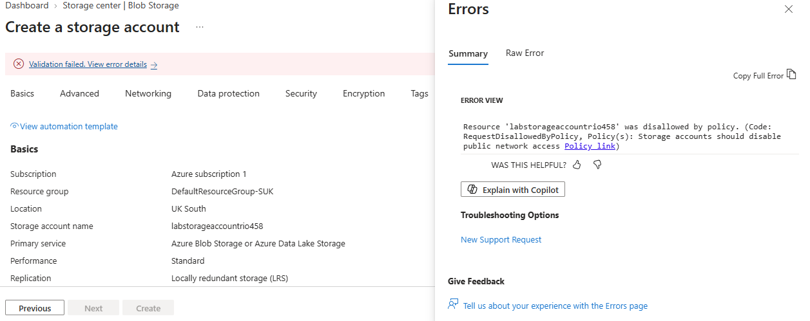

# Landing Zone Governance: Policy Inheritance at Scale

## Scenario

Following company growth (an acquisition, new product teams onboarding), the CTO wanted a way to stop the earlier pattern of ad-hoc, ungoverned resource creation from recurring — the same root problem that led to a publicly accessible storage account containing customer campaign assets in an earlier scenario. The goal: a structure where new subscriptions inherit consistent security guardrails automatically, rather than relying on someone remembering to configure each one individually.

## The design

A **Management Group** ("Lab Landing Zone") sitting above the subscription, with **Azure Policy** assignments applied at that management group level. Any subscription placed underneath — this one, or a future one — inherits those policies automatically, without any subscription-level configuration.

Two policies were assigned, targeting two genuinely different risks:
- **Anonymous blob access** — whether data in a storage account can be read with no authentication at all
- **Public network access** — whether the storage account is reachable from the public internet at all

These sound similar but are distinct settings, and that distinction turned out to be the actual core lesson of this lab.

## What actually happened (the real troubleshooting)

**1. Inheritance confirmed working.** After assigning a policy at the management group level, it appeared on the subscription's own Policy compliance page — despite never being assigned there directly — confirming inheritance was functioning as designed.

**2. A naming collision, not a policy failure.** The first attempt to test the policy failed with "storage account name already taken" — a global uniqueness conflict unrelated to the policy, since storage account names must be unique across all of Azure, not just within one subscription. A more distinctive name resolved this.

**3. Propagation delay.** A newly assigned policy took 5-15 minutes to become active. A test storage account created shortly after assignment deployed successfully with public access enabled — not because the policy failed, but because it hadn't started enforcing yet.

**4. The real gotcha: the first policy targeted the wrong specific setting.** After the propagation window passed, the subscription's compliance page showed **100% compliant**, despite two storage accounts genuinely having public network access enabled. The policy selected — "Configure your Storage account public access to be disallowed" — was correctly doing its job, but it evaluates **anonymous blob access**, not the broader **public network access** setting. Picking a policy based on a plausible-sounding name, without checking precisely which setting it evaluates, left a real gap.

**5. The fix.** A second, more precisely targeted policy — "Storage accounts should disable public network access" — was assigned alongside the first. Once live, it immediately flagged the two existing storage accounts as non-compliant:


...and then successfully **blocked** a third test storage account from being created at all:



```
Resource 'labstorageaccountrio458' was disallowed by policy.
(Code: RequestDisallowedByPolicy, Policy(s): Storage accounts should
disable public network access)
```

## What this demonstrates

- **Policy inheritance** — guardrails defined once at the management group level apply automatically to every subscription underneath, present and future, without per-subscription configuration
- **Detect vs. Protect, in practice** — the same policy first identified existing non-compliant resources (Detect), then blocked a new one from being created (Protect) once live
- **Verifying rather than assuming** — a policy with a plausible name and a working Deny effect can still target the wrong specific setting; checking actual behaviour against real test resources caught a gap that reading the policy name alone would have missed
- **Two policies, two distinct risks** — anonymous blob access and public network access are not the same control, and both matter

## Built two ways

1. **Manually, in the Azure portal** — including every wrong turn documented above
2. **As Terraform** — see `main.tf`, reflecting the corrected, working configuration

## Technologies

Azure Management Groups · Azure Policy · Terraform (azurerm provider) · Azure Storage

