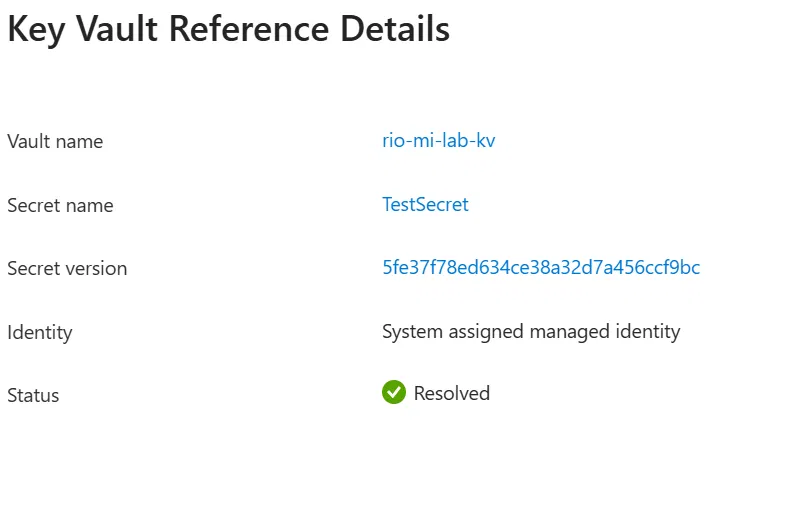
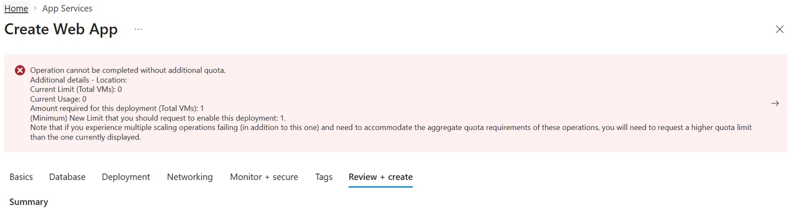
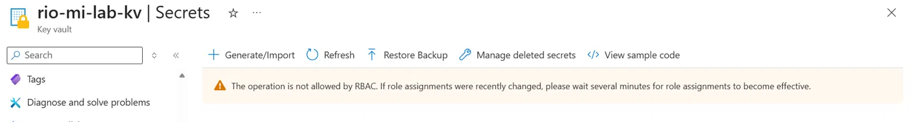
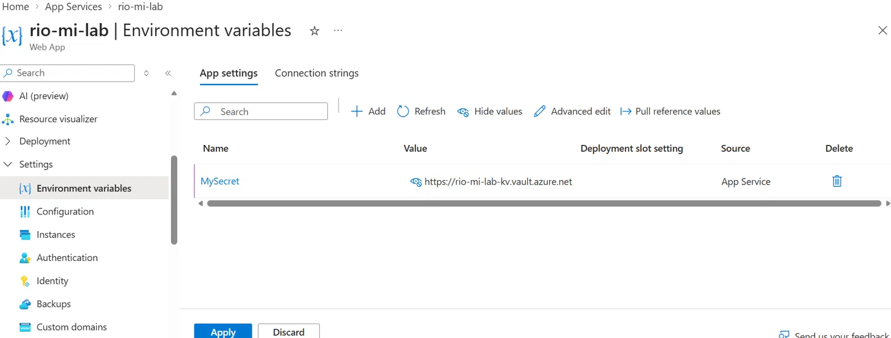

# Managed Identity + Key Vault: Removing Hardcoded Secrets

## Scenario

A developer had committed database credentials and an API key directly into a source code repository:

```
DB_PASSWORD = "M@rketing2024!"
API_KEY = "sk-live-8f3a9c2b1e7d4f6a"
```

Several other people had access to that repository. Even after removing the secrets from the current version of the file, they remained recoverable from the repository's commit history — deleting a secret from the latest file does not remove it from version control. The only real fix is rotating the credential and removing the need to store it in code at all.

## The fix

Instead of storing a rotated credential somewhere else (a config file, an environment variable set manually, a different repo), the App Service authenticates to Azure Key Vault using a **System-assigned Managed Identity** — an identity Azure manages automatically, with no credential to store, rotate, or leak, anywhere.

**Result:** the application retrieves its secret at runtime with zero credentials configured in code or application settings.

## Proof of concept



*The App Service authenticated to Key Vault and resolved the secret using its System-assigned Managed Identity — confirmed via the Key Vault Reference Details panel, with no credential stored anywhere in configuration.*

## What this demonstrates

- **Least privilege** — the Managed Identity was granted only the `Key Vault Secrets User` role (read-only), not broader Key Vault management access.
- **Elimination, not relocation, of the problem** — the goal wasn't to hide the secret somewhere safer, but to remove the need for a stored application credential entirely.
- **RBAC applies to everyone** — including the resource owner. My own account needed a separate role grant (`Key Vault Secrets Officer`) to manage the vault; creating a resource does not implicitly grant access to it.

## Built two ways

1. **Manually, in the Azure portal** — to understand exactly what each setting does (see `portal-steps.md`)
2. **As Terraform** — reflecting how this would actually be deployed under a no-ClickOps policy (see `main.tf`)

## Troubleshooting encountered

<details>
<summary>F1 (free tier) quota error on first deployment</summary>



Resolved by switching region — Azure trial subscriptions often have zero App Service quota for certain tiers in specific regions.
</details>

<details>
<summary>RBAC access error on my own account</summary>



After granting the App Service's Managed Identity access to the vault, my own user account had no permissions on it at all — "operation not allowed by RBAC." Had to separately grant myself a role (`Key Vault Secrets Officer`), since access isn't implied just by having created the resource.
</details>

<details>
<summary>Key Vault reference syntax — before resolution</summary>



The reference needs the full `@Microsoft.KeyVault(SecretUri=...)` wrapper with the exact secret version path, not just the vault's base URL.
</details>

## Technologies

Azure App Service · Azure Key Vault · Entra ID Managed Identity · Azure RBAC · Terraform


