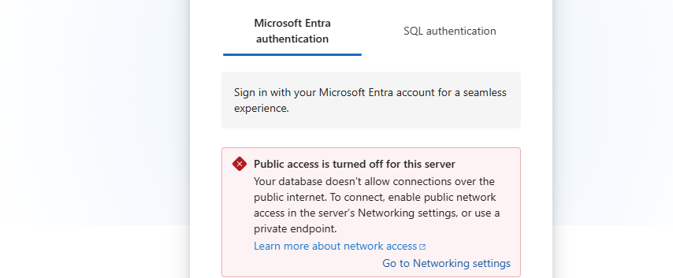

# Network Segmentation: Isolating a Database Behind Private Connectivity

## Scenario

A new customer-facing web application needed a database containing real customer records. The existing network was flat — a web app, database, and general office/admin resources all able to communicate freely, with no restrictions between them. The CTO wanted the database reachable only by the application that needed it — not the general office network, and not the public internet.

## The design

- A **VNet** divided into two **subnets**: `web-subnet` and `database-subnet` — isolated zones within the same private network space, each with its own address range
- A **Network Security Group (NSG)** attached to `database-subnet`, with a single inbound rule allowing traffic only from `web-subnet`, only on port 1433 (SQL) — everything else falls through to Azure's default deny-all rule
- **Azure SQL** deployed with **public network access disabled** and **Microsoft Entra-only authentication** — no standing SQL username/password credential, consistent with the Managed Identity principle from the first lab in this repo
- A **Private Endpoint** placed inside `database-subnet`, giving the SQL server a private IP address reachable only via Azure's private backbone — never the public internet

## What actually happened (the real build)

**1. Subnet address ranges must not overlap.** Each subnet needed its own distinct address block (`10.0.1.0/24`, `10.0.2.0/24`) within the VNet's overall space — because routing within a VNet works purely on IP address, with no separate identifier to disambiguate two resources sharing the same address in different subnets.

**2. Region availability constraint.** UK South (used for every other resource in this repo) wasn't available for SQL database creation on this trial subscription. Australia East was used instead. Private Endpoint connectivity still works across regions via Azure's private backbone, though co-locating resources in one region would be the production-grade choice, both for latency and potential data residency requirements.

**3. A costly default nearly slipped through.** The default SQL compute tier estimated at **$416/month**. Azure's free serverless offer (100,000 vCore seconds and 32GB storage free per month) had to be explicitly applied before creating anything — a reminder to always check the cost summary before clicking Create, not just at the end.

**4. Port confusion.** The first NSG rule attempt defaulted to MySQL (port 3306) instead of the correct SQL port (1433) — a reminder to verify the actual service/port rather than accepting a plausible-looking default.

**5. The real gotcha: Private Endpoints bypass NSG rules by default.** Attaching a Private Endpoint to `database-subnet` triggered a warning that the subnet's NSG could be disabled for that traffic. The subnet has its own separate setting — **Private endpoint network policy** — which must be explicitly set to enforce NSG rules; left at its default, the carefully built NSG rule would never have actually applied to traffic reaching the Private Endpoint. This is the single most important thing this lab surfaced: a correctly-configured NSG can still leave a gap if this setting isn't checked.

## Proof of concept

*Attempting to connect to the database via the Azure portal's Query editor — representing a connection from outside the trusted web-subnet path — was blocked outright: "Public access is turned off for this server."*

## What this demonstrates

- **Defence in layers, not a single control** — subnet isolation, NSG rules, disabled public access, and a Private Endpoint all had to work together; any one alone would have left a gap
- **Deny by default, allow by exception** — the NSG's single explicit "allow" rule works precisely because everything else falls through to Azure's default deny, including subnets that don't exist yet
- **Checking real behaviour, not just configuration** — the NSG-vs-Private-Endpoint policy gap would have been invisible without knowing to look for it specifically
- **Entra-only authentication over standing credentials** — same principle as Managed Identity in the first lab, applied here to database login

## Built two ways

1. **Manually, in the Azure portal** — including every real obstacle documented above
2. **As Terraform** — see `main.tf`

## Technologies

Azure Virtual Network · Subnets · Network Security Groups · Azure SQL · Private Endpoints · Microsoft Entra ID authentication · Terraform

