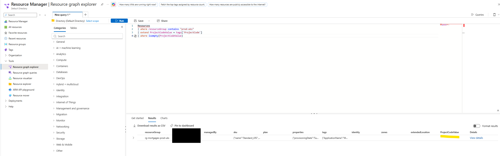
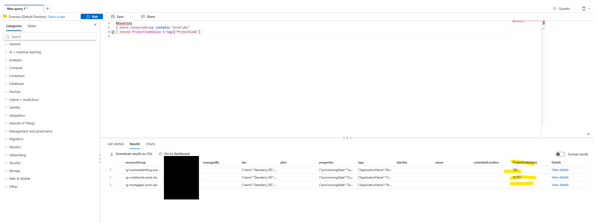
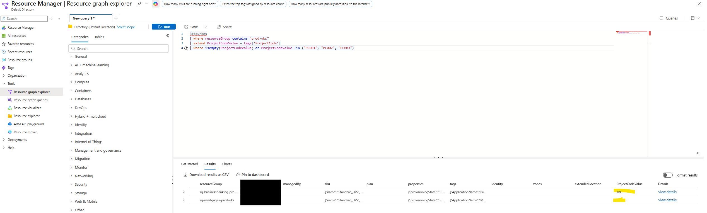
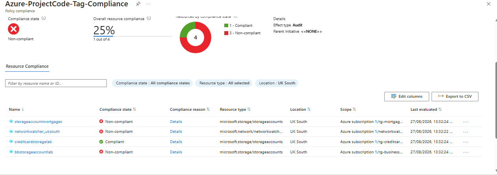
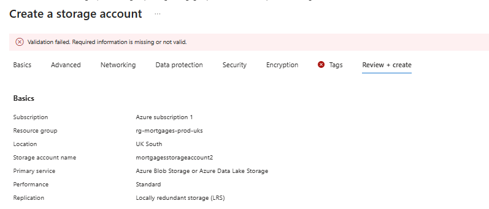
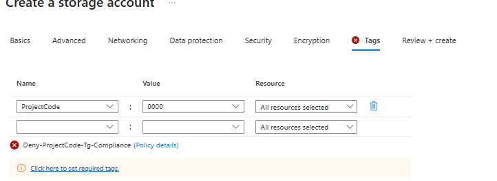

# Resource Graph Tag Governance: Detecting and Preventing Invalid Metadata

## Scenario

A periodic report at work had identified Azure resources with missing or invalid `ProjectCode` tags. The existing process was reactive: wait for a report, identify the resource owner, ask them to fix it. There was no way for Governance to self-serve this visibility — it depended on someone manually producing a CSV, and even then, nothing stopped the same problem recurring next time.

This raised a set of questions worth answering hands-on, in a sanitised personal lab: where does tag data actually live, how can it be queried at scale, is "the tag exists" the same thing as "the tag is correct" — and once you can detect the problem, can you go further and actually prevent it?

## The design

Three fictional business lines, each with its own resource group and one storage account, deliberately tagged to represent three different real-world states:

| Business line | Resource group | ProjectCode | Represents |
|---|---|---|---|
| Credit Cards | `rg-creditcards-prod-uks` | `PC001` | Valid (control case) |
| Mortgages | `rg-mortgages-prod-uks` | *(not set)* | Missing tag |
| Business Banking | `rg-businessbanking-prod-uks` | `TBC` | Present but meaningless |

The goal was to prove — with real queries and real policies against real resources, not assumption — that "missing" and "invalid" are two different failure modes, that a control designed to catch one won't automatically catch the other, and that detecting non-compliance (Audit) is a fundamentally different capability from preventing it (Deny).

**Scope decision:** the list of valid ProjectCodes is hardcoded directly into the KQL query and the Policy definition, rather than pulled from an external source of truth. Both Resource Graph and Azure Policy can only evaluate values available to them at evaluation time — they can't call out to a live CSV or database mid-evaluation. A hardcoded list means updating it requires a code/definition change rather than a simple data edit, which doesn't scale in a real enterprise. For this lab, that trade-off was accepted deliberately rather than building a Function/Logic App integration that would have added complexity without adding to the core lesson. Documented here as a known limitation, not an oversight.

## Part 1: Discovery with Resource Graph and KQL

**1. Tags do not inherit from resource group to resource.** Tagging the resource group did nothing to the storage account created inside it — confirmed by checking the storage account's own Tags blade and finding it empty until tagged explicitly. Every resource needs its own tags; there is no automatic inheritance in the portal.

**2. An unplanned Deny policy hit — a live example of Deny vs Audit, before the lab even got there deliberately.** Creating the first storage account failed validation: a built-in policy disallowed public network access. This wasn't something I'd configured — it stopped the deployment before the resource ever existed, and became an early, concrete preview of the Audit vs Deny distinction the lab would go on to test properly.

**3. First KQL attempt at the combined query returned zero rows.** The intent was "flag a resource if its ProjectCode is empty OR not in the valid list," written as:

```kql
| where isempty( tags["ProjectCode"] !in ("PC001", "PC002", "PC003") )
```

This nests a boolean expression (`!in`, which already evaluates to true/false) inside `isempty()`, which expects a value to test for blankness — not another boolean. The fix was to stop nesting and join the two independent conditions with `or`:

```kql
Resources
| where resourceGroup contains "prod-uks"
| extend ProjectCodeValue = tags['ProjectCode']
| where isempty(ProjectCodeValue) or ProjectCodeValue !in ("PC001", "PC002", "PC003")
```

**4. A typo in the allow-list would have produced a false positive.** An early draft of the valid list read `"PR001", "PR002", "PR003"` instead of `PC0xx` — which would have wrongly flagged the valid Credit Cards resource as non-compliant. Caught before running, but a reminder that a hardcoded allow-list is only as reliable as whoever typed it; a single typo silently breaks trust in the control's output.

**5. Proof that "missing" and "invalid" genuinely need different queries.** Running `isempty()` alone correctly found the missing-tag resource (Mortgages) but said nothing about the invalid-value resource (Business Banking, `TBC`) — because `TBC` is a non-empty string, so a presence check alone is blind to it:


*`isempty(ProjectCodeValue)` correctly isolates Mortgages — but Business Banking's `TBC` value doesn't appear, since it isn't empty.*

Extending the query with tag values visible across all three resources made the gap easy to see directly:


*Credit Cards (`PC001`), Business Banking (`TBC`), Mortgages (blank) — the difference between "wrong" and "missing" is visible, but not yet flagged automatically.*

Combining both conditions with `or` correctly caught both failure modes in a single query, while leaving the valid resource untouched:


*`isempty(ProjectCodeValue) or ProjectCodeValue !in (...)` returns exactly Mortgages and Business Banking — Credit Cards correctly does not appear.*

## Part 2: From detection to enforcement with Azure Policy

A KQL query only surfaces the problem when someone chooses to run it. The next step was encoding the same logic into Azure Policy — first as **Audit**, for always-on visibility with no manual query required, then as **Deny**, to test whether the same logic could stop non-compliant resources from being created at all.

### Audit

A custom Policy definition (`Audit-ProjectCode-Tag-Compliance`) expresses the same "missing OR invalid" logic as the KQL query, but in Policy's own declarative rule language rather than KQL:

```json
{
  "mode": "All",
  "policyRule": {
    "if": {
      "anyOf": [
        {
          "field": "tags['ProjectCode']",
          "exists": "false"
        },
        {
          "field": "tags['ProjectCode']",
          "notIn": ["PC001", "PC002", "PC003"]
        }
      ]
    },
    "then": {
      "effect": "audit"
    }
  }
}
```

**Troubleshooting:** the first save attempt failed with `Could not find member 'if' on object of type 'PolicyDefinitionProperties'` — the `if`/`then` block had been pasted at the top level instead of nested inside a `"policyRule"` key, alongside a required `"mode"` key. Comparing against the portal's own placeholder skeleton (before it was deleted) showed the correct wrapping. A second attempt then failed as invalid JSON — one of the two objects inside the `anyOf` array was missing its opening `{`. Both errors were diagnosed from the error message and structural comparison, not fixed by guesswork.

Once assigned and after the normal propagation delay, the compliance dashboard showed exactly the predicted result:


*Mortgages and Business Banking correctly flagged non-compliant; Credit Cards correctly compliant. A fourth entry (Network Watcher) briefly appeared non-compliant after being deleted — a stale compliance record from before deletion, not a fault in the policy; compliance state only updates on the next evaluation cycle, not instantly on resource deletion.*

### Deny

The same rule, same conditions, with only `"effect": "audit"` changed to `"effect": "deny"` (`Deny-ProjectCode-Tag-Compliance`), assigned with enforcement mode **Default** (enforced) rather than **DoNotEnforce** — a deliberate choice for this lab since the goal was to prove Deny actually blocks; in a real production rollout, `DoNotEnforce` would be the correct first stage, to observe impact before committing to enforcement.

Tested by attempting to create a fourth storage account with no ProjectCode tag at all:


*Validation failed before the resource could be created, flagged on the Tags tab specifically.*

Then tested again with a present-but-invalid value (`0000`), to check whether Deny handled the `notIn` condition as reliably as the `exists: false` condition:


*Blocked again — this time with the policy named directly (`Deny-ProjectCode-Tag-Compliance`) on the Tags tab, before Review + Create was even reached.*

Both conditions were blocked equally reliably — no asymmetry between "missing" and "invalid" under Deny, closing the open question carried over from the Audit phase.

## What this demonstrates

- **Presence and validity are different technical checks, not one problem** — a control built to catch missing tags will not catch meaningless ones, whether written as a KQL query or a Policy rule, and treating them as the same check creates a false sense of coverage.
- **Governance self-serve, proven at two levels** — a KQL query replaced manual, resource-by-resource checking; an Audit policy then removed the need to even run the query, surfacing the same result as an always-current dashboard.
- **Detect vs. Prevent, tested rather than assumed** — Audit gives visibility without blocking anything; Deny stops the non-compliant state from ever existing. Both were proven against the same three resources and the same underlying logic, not just described conceptually.
- **The same governance rule, expressed in two different languages** — KQL for on-demand querying, Policy's JSON rule schema for continuous evaluation and enforcement — solving related but distinct problems with different tools.
- **A control is only as trustworthy as the assumptions behind it** — a typo in a hardcoded allow-list, a boolean nested inside the wrong function, or a JSON object missing a brace would each have silently produced an incorrect result rather than an obvious failure; each was caught by comparing expected vs. actual output, not assumed to be correct.
- **Compliance state has a lag, in both directions** — newly assigned policies take time to first evaluate resources; deleted resources can persist on the compliance dashboard until the next scan. Neither is a fault in the control.

## Status / next steps

Both detection (KQL, Resource Graph) and enforcement (Azure Policy, Audit and Deny) are now built and evidenced manually in the portal.

- **Not yet done:** Terraform recreation of the resource groups, storage accounts, and the two Policy definitions/assignments — deliberately left until the manual, portal-driven logic above was fully understood and evidenced first, consistent with the rest of this repo's approach.

## Technologies

Azure Resource Graph · Kusto Query Language (KQL) · Azure Policy (Audit and Deny effects, custom definitions) · Azure Storage · Azure Tags

